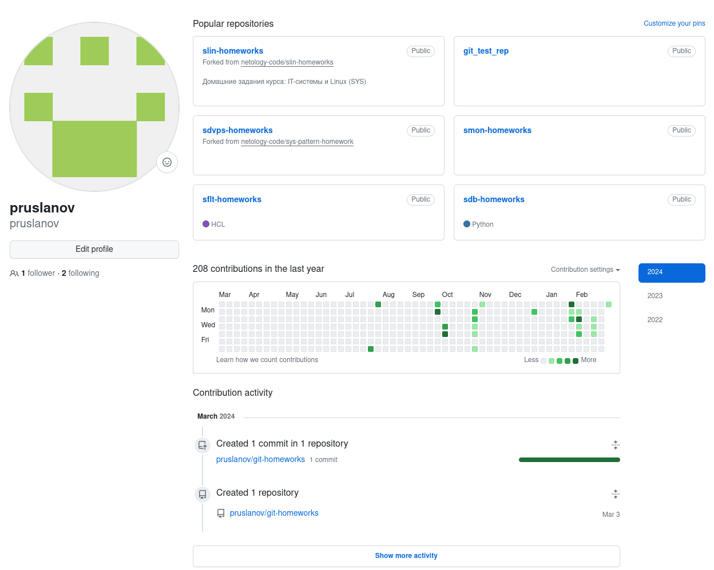
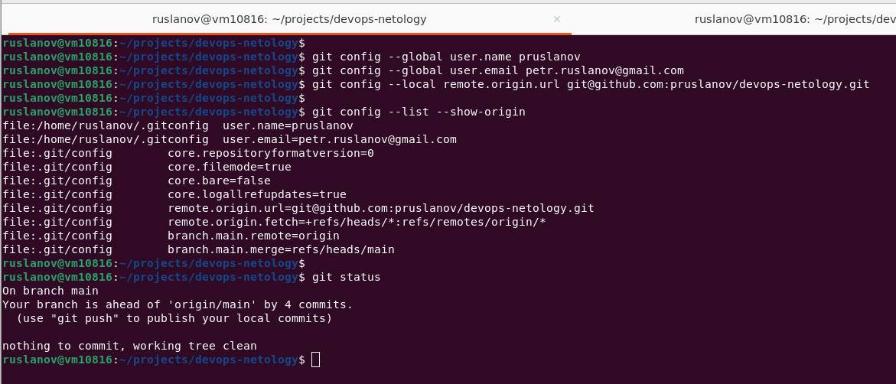

# Домашнее задание к занятию «Системы контроля версий»

### Дополнительные материалы для выполнения задания

1. [GitHub](https://github.com/).
2. [Инструкция по установке Git](https://git-scm.com/downloads).
3. [Книга про  Git на русском языке](https://git-scm.com/book/ru/v2/) - рекомендуем к обязательному изучению главы 1-7.
   
   
------

## Задание 1. Создать и настроить репозиторий для дальнейшей работы на курсе

В рамках курса вы будете писать скрипты и создавать конфигурации для различных систем, которые необходимо сохранять для будущего использования. 
Сначала надо создать и настроить локальный репозиторий, после чего добавить удалённый репозиторий на GitHub.

### Создание репозитория и первого коммита

1. Зарегистрируйте аккаунт на [https://github.com/](https://github.com/). Если предпочитаете другое хранилище для репозитория, можно использовать его.

Профиль пользователя



2. Создайте публичный репозиторий, который будете использовать дальше на протяжении всего курса, желательное с названием `devops-netology`.
   Обязательно поставьте галочку `Initialize this repository with a README`. 

Создание репозитория `devops-netology`


Репозиторий `devops-netology` создан


    
3. Создайте [авторизационный токен](https://docs.github.com/en/authentication/keeping-your-account-and-data-secure/creating-a-personal-access-token) для клонирования репозитория.
4. Склонируйте репозиторий, используя протокол HTTPS (`git clone ...`).

`git clone https://github.com/pruslanov/devops-netology.git`
 

    
5. Перейдите в каталог с клоном репозитория (`cd devops-netology`).
6. Произведите первоначальную настройку Git, указав своё настоящее имя, чтобы нам было проще общаться, и email (`git config --global user.name` и `git config --global user.email johndoe@example.com`). 
7. Выполните команду `git status` и запомните результат.

```bash
git config --global user.name pruslanov
git config --global user.email petr.ruslanov@gmail.com
git config --local remote.origin.url git@github.com:pruslanov/git-homeworks.git
git config --list --show-origin
git status
```



8. Отредактируйте файл `README.md` любым удобным способом, тем самым переведя файл в состояние `Modified`.
9. Ещё раз выполните `git status` и продолжайте проверять вывод этой команды после каждого следующего шага.

```bash
cat README.md
echo "First text line" >> README.md
cat README.md
git status
```


10. Теперь посмотрите изменения в файле `README.md`, выполнив команды `git diff` и `git diff --staged`.
11. Переведите файл в состояние `staged` (или, как говорят, просто добавьте файл в коммит) командой `git add README.md`.
12. И ещё раз выполните команды `git diff` и `git diff --staged`. Поиграйте с изменениями и этими командами, чтобы чётко понять, что и когда они отображают. 
13. Теперь можно сделать коммит `git commit -m 'First commit'`.
14. И ещё раз посмотреть выводы команд `git status`, `git diff` и `git diff --staged`.


### Создание файлов `.gitignore` и второго коммита

1. Создайте файл `.gitignore` (обратите внимание на точку в начале файла), проверьте его статус сразу после создания. 
2. Добавьте файл `.gitignore` в следующий коммит (`git add...`).
3. На одном из следующих блоков вы будете изучать `Terraform`, давайте сразу создадим соотвествующий каталог `terraform` и внутри этого каталога — файл `.gitignore` по примеру: https://github.com/github/gitignore/blob/master/Terraform.gitignore. 

```bash
touch .gitignore
mkdir terraform
git add .
wget -P ~/projects/devops-netology/terraform -O .gitignore https://github.com/github/gitignore/blob/main/Terraform.gitignore
```


4. В файле `README.md` опишите своими словами, какие файлы будут проигнорированы в будущем благодаря добавленному `.gitignore`.

```bash
# devops-netology
First text line

# Игнорируем во всех поддректориях содержиое поддиретории .terraform
**/.terraform/*

# Игнорируем файл с расширением .tfstate и содержащие в названии .tfstate.
*.tfstate
*.tfstate.*

# Игноринуем логи Crash log files
crash.log
crash.*.log

# Exclude all .tfvars files, which are likely to contain sensitive data, such as
# password, private keys, and other secrets. These should not be part of version 
# control as they are data points which are potentially sensitive and subject 
# to change depending on the environment.
#
# Игнорируем файлы с оканчивающиеся на .tfvars и .tfvars.json
*.tfvars
*.tfvars.json

# Ignore override files as they are usually used to override resources locally and so
# are not checked in
# 
# Игнориуем файлы с именами override.tf и override.tf.json и окончивающиеся на _override.tf и _override.tf.json
override.tf
override.tf.json
*_override.tf
*_override.tf.json

# Включить example_override.tf после исключающего предыдущего правила 
#
# Include override files you do wish to add to version control using negated pattern
# !example_override.tf
 

# Include tfplan files to ignore the plan output of command: terraform plan -out=tfplan
# example: *tfplan*

# Ignore CLI configuration files
# 
# Игнорировать файлы .terraformrc и terraform.rc
.terraformrc
terraform.rc
```

5. Закоммитьте все новые и изменённые файлы. Комментарий к коммиту должен быть `Added gitignore`.


### Эксперимент с удалением и перемещением файлов (третий и четвёртый коммит)

1. Создайте файлы `will_be_deleted.txt` (с текстом `will_be_deleted`) и `will_be_moved.txt` (с текстом `will_be_moved`) и закоммите их с комментарием `Prepare to delete and move`.

```bash
echo "will_be_deleted" > will_be_deleted.txt
echo "will_be_moved" > will_be_moved.txt
git add .
git commit -m "Prepare to delete and move"
```


2. В случае необходимости обратитесь к [официальной документации](https://git-scm.com/book/ru/v2/Основы-Git-Запись-изменений-в-репозиторий) — здесь подробно описано, как выполнить следующие шаги. 
3. Удалите файл `will_be_deleted.txt` с диска и из репозитория. 

```bash
rm will_be_deleted.txt
git rm will_be_deleted.txt
```


4. Переименуйте (переместите) файл `will_be_moved.txt` на диске и в репозитории, чтобы он стал называться `has_been_moved.txt`.

`git mv will_be_moved.txt has_been_moved.txt`


5. Закоммитьте результат работы с комментарием `Moved and deleted`.

```bash
git status
git commit -m "Moved and deleted"
```


### Проверка изменения

1. В результате предыдущих шагов в репозитории должно быть как минимум пять коммитов (если вы сделали ещё промежуточные — нет проблем):
    * `Initial Commit` — созданный GitHub при инициализации репозитория. 
    * `First commit` — созданный после изменения файла `README.md`.
    * `Added gitignore` — после добавления `.gitignore`.
    * `Prepare to delete and move` — после добавления двух временных файлов.
    * `Moved and deleted` — после удаления и перемещения временных файлов. 
2. Проверьте это, используя комманду `git log`. Подробно о формате вывода этой команды мы поговорим на следующем занятии, но посмотреть, что она отображает, можно уже сейчас.

`git log`


### Отправка изменений в репозиторий

Выполните команду `git push`, если Git запросит логин и пароль — введите ваши логин и пароль от GitHub. 

В качестве результата отправьте ссылку на репозиторий. 

----

### Правила приёма домашнего задания

В личном кабинете отправлена ссылка на ваш репозиторий.


### Критерии оценки

Зачёт:

* выполнены все задания;
* ответы даны в развёрнутой форме;
* приложены соответствующие скриншоты и файлы проекта;
* в выполненных заданиях нет противоречий и нарушения логики.

На доработку:

* задание выполнено частично или не выполнено вообще;
* в логике выполнения заданий есть противоречия и существенные недостатки. 