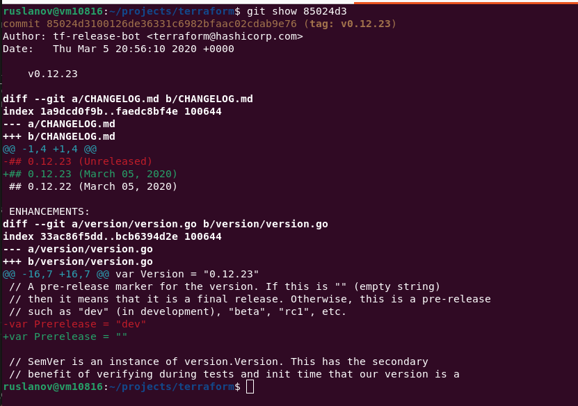
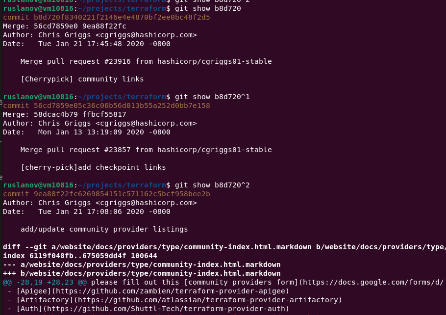
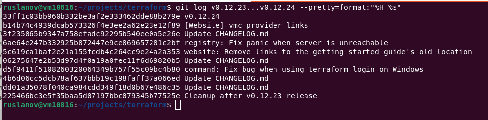
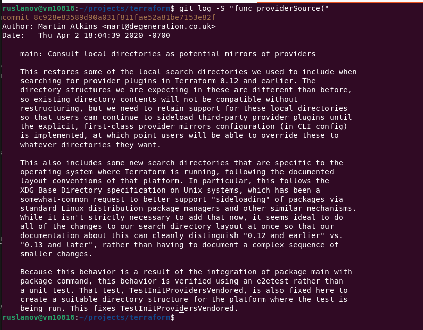
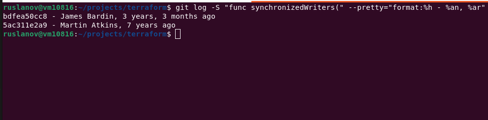

# Домашнее задание к занятию «Инструменты Git»

### Цель задания

В результате выполнения задания вы:

* научитесь работать с утилитами Git;
* потренируетесь решать типовые задачи, возникающие при работе в команде. 

### Инструкция к заданию

1. Склонируйте [репозиторий](https://github.com/hashicorp/terraform) с исходным кодом Terraform.
2. Создайте файл для ответов на задания в своём репозитории, после выполнения прикрепите ссылку на .md-файл с ответами в личном кабинете.
3. Любые вопросы по решению задач задавайте в чате учебной группы.

------

## Задание

В клонированном репозитории:

1. Найдите полный хеш и комментарий коммита, хеш которого начинается на `aefea`.
2. Ответьте на вопросы.

* Какому тегу соответствует коммит `85024d3`?

`git show 85024d3`

tag: v0.12.23



* Сколько родителей у коммита `b8d720`? Напишите их хеши.

```bash
git show b8d720
git show b8d720^1
git show b8d720^2
```
или

`git log --pretty=%P -n 1 b8d720`

Merge коммит двух других коммитов (родителей): 56cd7859e0 (commit 56cd7859e05c36c06b56d013b55a252d0bb7e158) 9ea88f22fc (commit 9ea88f22fc6269854151c571162c5bcf958bee2b)



* Перечислите хеши и комментарии всех коммитов, которые были сделаны между тегами  v0.12.23 и v0.12.24.

`git log v0.12.23...v0.12.24 --pretty=format:"%H %s"`



* Найдите коммит, в котором была создана функция `func providerSource`, её определение в коде выглядит так: `func providerSource(...)` (вместо троеточия перечислены аргументы).

```bash
$ git log -S "func providerSource(" --pretty=format:"%h %s"
8c928e8358 main: Consult local directories as potential mirrors of providers
$
```

8c928e83589d90a031f811fae52a81be7153e82f



* Найдите все коммиты, в которых была изменена функция `globalPluginDirs`.

```bash
$ git log -S "func globalPluginDirs" --oneline
8364383c35 Push plugin discovery down into command package
```

> Дополнение

Находим в каких файлах объявляется функция `globalPluginDirs`

```bash
$ git grep "func globalPluginDirs"
plugins.go:func globalPluginDirs() []string {
$ 
```

Историй изменений самой функции в файле `plugins.go` из предыдущего поиска

`git log -L :globalPluginDirs:plugins.go`


* Кто автор функции `synchronizedWriters`? 

```bash
$ git log -S "func synchronizedWriters(" --pretty="format:%h - %an, %ar"
bdfea50cc8 - James Bardin, 3 years, 3 months ago
5ac311e2a9 - Martin Atkins, 7 years ago
$ 
```

Автор: Martin Atkins (выбараем по наименьшей дате)



*В качестве решения ответьте на вопросы и опишите, как были получены эти ответы.*

---

### Правила приёма домашнего задания

В личном кабинете отправлена ссылка на .md-файл в вашем репозитории.

### Критерии оценки

Зачёт:

* выполнены все задания;
* ответы даны в развёрнутой форме;
* приложены соответствующие скриншоты и файлы проекта;
* в выполненных заданиях нет противоречий и нарушения логики.

На доработку:

* задание выполнено частично или не выполнено вообще;
* в логике выполнения заданий есть противоречия и существенные недостатки.